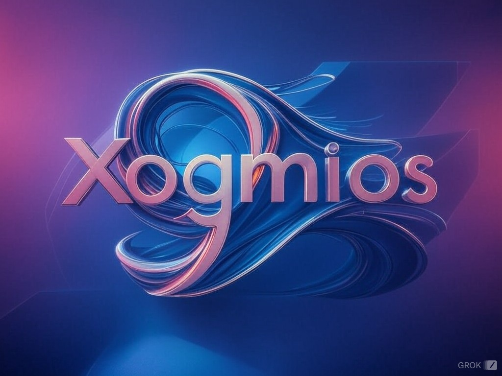

# Xogmios


[](https://hex.pm/packages/xogmios)

<p align="center">
  
</p>


📖 [Documentation](https://hexdocs.pm/xogmios/)

Xogmios is an Elixir client for the Cardano blockchain. You can use it to perform queries, stream blocks as they become available and submit transactions to the network.

It connects to a Cardano node through [Ogmios](https://github.com/CardanoSolutions/ogmios).

> Ogmios is a lightweight bridge interface for a Cardano node. It offers a WebSockets API that enables local clients to speak Ouroboros' mini-protocols via JSON/RPC. - https://ogmios.dev/

Mini-Protocols supported by this library:

- [x] Chain Synchronization
- [x] State Query
- [x] Tx Submission
- [x] Mempool Monitoring (reads transactions only)

See [Examples](#examples) section below for information on how to use this library.

## Installation

Add the dependency to `mix.exs`:

```elixir
defp deps do
  [
    {:xogmios, ">= 0.0.0"}
  ]
end
```

Then run `mix deps.get`

## Setup

The mix task `xogmios.gen.client` is available to help generate the necessary
client code for each of the supported mini-protocols. Information on usage can
be found by running the following mix task:

```bash
mix help xogmios.gen.client
```

For example, the following mix task generates a client module for the
ChainSync mini-protocol:

```bash
mix xogmios.gen.client -p chain_sync ChainSyncClient
```

A new file should be created at _./lib/my_app/chain_sync_client.ex_

```elixir
defmodule MyApp.ChainSyncClient do
  @moduledoc """
  This module syncs with the chain and reads new blocks
  as they become available.
  """

  use Xogmios, :chain_sync

  def start_link(opts) do
    initial_state = []
    opts = Keyword.merge(opts, initial_state)
    Xogmios.start_chain_sync_link(__MODULE__, opts)
  end

  @impl true
  def handle_block(block, state) do
    IO.puts("handle_block #{block["height"]}")
    {:ok, :next_block, state}
  end
end
```

Add this new module to your application's supervision tree as such:

```elixir
# file: application.ex
def start(_type, _args) do
  ogmios_url = System.fetch_env!("OGMIOS_URL")

  children = [
    {MyApp.ChainSyncClient, url: ogmios_url}
  ]
  #...
end
```

Be sure the env `OGMIOS_URL` is populated and then start your mix application.

The value for the `url` option should be set to the address of your Ogmios instance.

If you don't have access to an Ogmios endpoint, you can use https://demeter.run/ and start one for free.

**Note**: Xogmios only accepts `ws` or `wss` schemes. In order to connect to the Demeter Ogmios endpoint, you might need to replace the `https` scheme with `wss` on the URI that is displayed on the Demeter console.

See section below for examples of client modules.

## Examples

### Chain Sync

The following is an example of a module that implement the **Chain Sync** behaviour. In this example, the client syncs with the tip of the chain, reads the next 3 blocks and then closes the connection with the server.

```elixir
defmodule ChainSyncClient do
  use Xogmios, :chain_sync

  def start_link(opts) do
    initial_state = [counter: 3]
    opts = Keyword.merge(opts, initial_state)
    Xogmios.start_chain_sync_link(__MODULE__, opts)
  end

  @impl true
  def handle_block(block, %{counter: counter} = state) when counter > 1 do
    IO.puts("handle_block #{block["height"]}")
    {:ok, :next_block, %{state | counter: counter - 1}}
  end

  @impl true
  def handle_block(block, state) do
    IO.puts("final handle_block #{block["height"]}")
    {:close, state}
  end

  @impl true
  def handle_rollback(point, state) do
    IO.puts("handle_rollback")

    # Use this information to update your custom state accordingly
    IO.puts("Block id: #{point["id"]}")
    IO.puts("Slot: #{point["slot"]}")

    {:ok, :next_block, state}
  end
end
```

### State Query

The following illustrates working with the **State Query** protocol. It runs queries against the tip of the chain.

```elixir
defmodule StateQueryClient do
  use Xogmios, :state_query
  alias Xogmios.StateQuery

  def start_link(opts) do
    Xogmios.start_state_link(__MODULE__, opts)
  end

  def get_current_epoch(pid \\ __MODULE__) do
    # Defaults to Ledger-state queries.
    # The following call is the same as calling
    # `StateQuery.send_query(pid, "queryLedgerState/epoch")`
    StateQuery.send_query(pid, "epoch")
  end

  def get_network_height(pid \\ __MODULE__) do
    # For network queries, scope must be explicitly used.
    StateQuery.send_query(pid, "queryNetwork/blockHeight")`
  end

  def send_query_no_params(pid \\ __MODULE__, query_name) do
    StateQuery.send_query(pid, query_name)
  end

  def send_query(pid \\ __MODULE__, query_name, query_params) do
    # Optional query params are sent as the third argument
    # to StateQuery.send_query/3
    StateQuery.send_query(pid, query_name, query_params)
  end
end
```

### Tx Submission

The following illustrates working with the **Transaction Submission** protocol. It submits a signed transaction, represented as a CBOR, to the Ogmios server.

```elixir
defmodule TxSubmissionClient do
  use Xogmios, :tx_submission
  alias Xogmios.TxSubmission

  def start_link(opts) do
    Xogmios.start_tx_submission_link(__MODULE__, opts)
  end

  def submit_tx(pid \\ __MODULE__, cbor) do
    # The CBOR must be a valid transaction,
    # properly built and signed
    TxSubmission.submit_tx(pid, cbor)
  end
end
```

### Mempool Monitoring

The following illustrates working with the **Mempool Monitoring** protocol. It provides a way to list transactions in the mempool.

```elixir
defmodule MempoolTxsClient do
  @moduledoc """
  This module prints transactions as they become available
  in the mempool
  """
  use Xogmios, :mempool_txs

  def start_link(opts) do
    Xogmios.start_mempool_txs_link(__MODULE__, opts)
  end

  # Callbacks
  @impl true
  def handle_acquired(%{"slot" => slot} = _snapshot, state) do
    IO.puts("Snapshot acquired at slot #{slot}")

    {:ok, :next_transaction, state}
  end

  @impl true
  def handle_transaction(transaction, state) do
    IO.puts("Transaction: #{transaction["id"]}")

    {:ok, :next_transaction, state}
  end
end
```

For examples of applications using this library, see [Blocks](https://github.com/wowica/blocks) and [xogmios_watcher](https://github.com/wowica/xogmios_watcher).

## Test

Run `mix test`. Tests do NOT rely on a running Ogmios instance.

## Help

Join the #elixir channel in the [TxPipe Discord](https://discord.gg/ZTHcHUy5HY)
